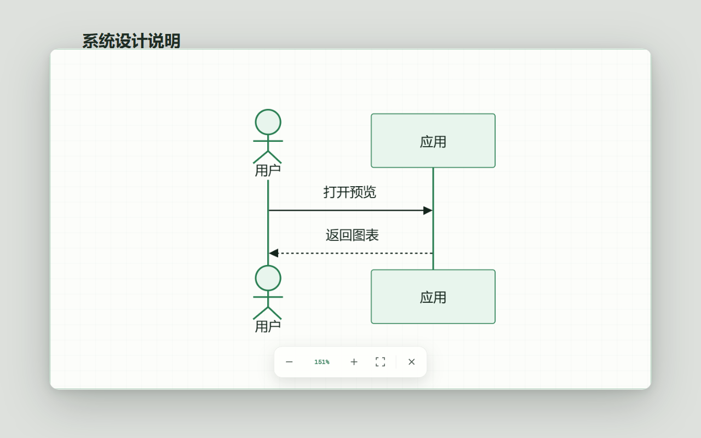
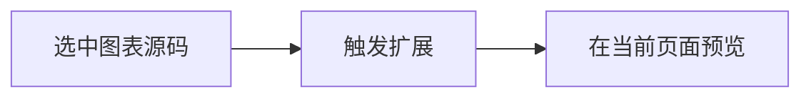
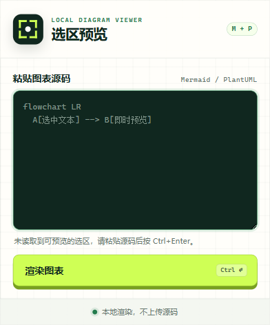
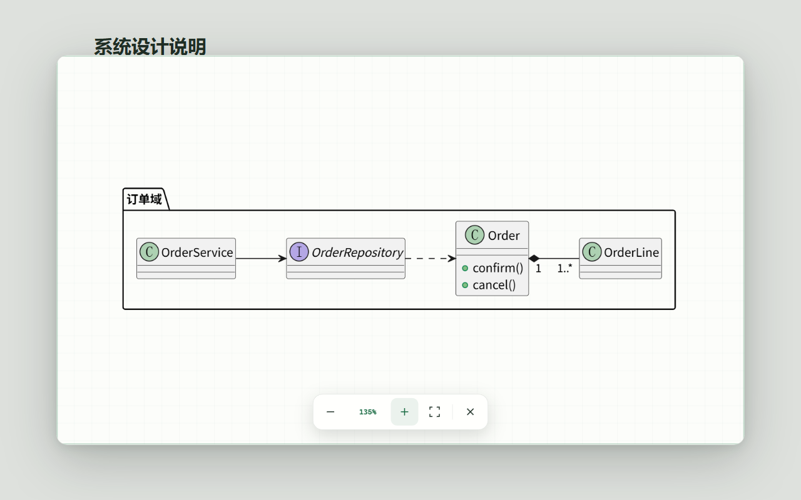

# Mermaid & PlantUML 选区预览

一个在 Chrome 当前页面中本地预览 Mermaid 与 PlantUML 的扩展。选中图表源码后，可以通过右键菜单、扩展图标或快捷键打开预览；即使网站屏蔽右键，也不必离开原文档。

[下载安装包](https://github.com/Tudou77826/mermaid-plantuml-selection-preview/releases/latest) · [完整使用说明](docs/USAGE.md) · [隐私政策](PRIVACY.md) · [Chrome 网上应用店](https://chromewebstore.google.com/detail/ahonaanmkbgmcbjlhfgpfleigbmedmlh)



图表显示在原页面上方的轻量浮层中，可以缩放、拖动和自动适应窗口。

## 功能

- 自动识别 Mermaid 与 PlantUML。
- 页面没有原生右键菜单时，可点击扩展图标或按快捷键读取选区；读取失败时可以直接粘贴源码。
- 支持包含或不包含 Markdown 代码围栏的选区。
- 在原页面上方显示轻量浮层，不跳转页面。
- 支持滚轮缩放、鼠标拖动、双击适应窗口和键盘快捷键。
- Mermaid 与 PlantUML 全部在浏览器本地渲染，不上传源码。
- 只在用户主动点击右键菜单、扩展图标或快捷键后临时访问当前页面。

## 安装

### Chrome 网上应用店

通过 [Chrome 网上应用店页面](https://chromewebstore.google.com/detail/ahonaanmkbgmcbjlhfgpfleigbmedmlh) 安装。若商店版本仍在审核，可使用下面的手动安装方式。

### GitHub Release

1. 从 [Releases](https://github.com/Tudou77826/mermaid-plantuml-selection-preview/releases/latest) 下载名称形如 `mermaid-plantuml-selection-preview-<版本号>.zip` 的文件。
2. 将 ZIP 解压到固定目录。
3. 打开 `chrome://extensions`。
4. 开启右上角“开发者模式”。
5. 点击“加载已解压的扩展程序”，选择刚才解压的目录。

手动安装的版本不会通过 Chrome 网上应用店自动更新。升级时需要下载新版 Release 并替换目录。

## 使用

### 1. 选中图表源码

在网页中完整选中一段 Mermaid 或 PlantUML 源码。选区可以包含 Markdown 代码围栏，也可以只包含图表正文。

````markdown

````

PlantUML 可以选中完整的 `@startuml` 到 `@enduml`，也可以选择缺少这两个标记的正文，扩展会自动补齐。

### 2. 选择一个入口

| 页面情况 | 推荐操作 |
| --- | --- |
| 页面可以正常打开右键菜单 | 右键选区，点击“预览 Mermaid / PlantUML 图” |
| 页面屏蔽了右键菜单 | 点击浏览器工具栏中的扩展图标 |
| 希望只用键盘操作 | 按 `Ctrl+Shift+M`，可在 `chrome://extensions/shortcuts` 中修改 |
| 扩展无法读取页面选区 | 在扩展图标打开的输入框中粘贴源码，按 `Ctrl+Enter` |

点击扩展图标时，扩展会先尝试读取当前页面以及可访问 iframe 中的选区。读取成功会直接打开预览；读取不到选区时才显示粘贴框。



### 3. 查看和调整图表

预览浮层不会跳转到其他页面。可以直接缩放和移动图表，查看完成后点击浮层外区域、关闭按钮或按 `Esc` 退出。



常用操作：

| 操作 | 鼠标或键盘 |
| --- | --- |
| 放大 / 缩小 | 滚轮、`+`、`-` |
| 移动画布 | 按住鼠标拖动 |
| 适应窗口 | 双击画布或按 `0` |
| 恢复 100% | `1` |
| 关闭预览 | 点击浮层外区域、关闭按钮或按 `Esc` |

### 支持的源码形式

- Mermaid 正文，以及 `mermaid` Markdown 围栏。
- PlantUML 正文，以及 `plantuml`、`puml`、`uml` Markdown 围栏。
- 带围栏但没有选中结尾围栏的 Mermaid 源码。
- 缺少 `@startuml` 和 `@enduml` 的 PlantUML 正文。

更多示例、限制与故障排查见 [使用说明](docs/USAGE.md)。

### 常见问题

**点击扩展图标后没有直接显示图表**

确认选区包含完整图表。部分网页使用特殊编辑器，浏览器无法读取其选区；此时扩展会显示粘贴框，可以手动粘贴源码。

**`Ctrl+Shift+M` 没有反应**

打开 `chrome://extensions/shortcuts`，确认快捷键已经分配且没有与其他扩展冲突。Chrome 内部页面和 Chrome 应用商店页面不允许普通扩展执行页面脚本。

**本地 HTML 页面无法使用扩展**

在扩展详情页启用“允许访问文件网址”，或者通过本地 HTTP 服务打开该页面。

## 隐私与安全

- 不申请全站网页读取权限。
- 选区只在本机用于生成预览，不访问远程渲染服务。
- 一次性选区读取后立即删除；异常残留最多保留 5 分钟。
- Mermaid 使用严格安全模式渲染。
- PlantUML 禁止 `!include` 和 `!import`，避免隐式网络或文件读取。

详细说明见 [隐私政策](PRIVACY.md)。

## 本地开发

需要 Node.js 20+ 与 Chrome。

```powershell
npm install
npm run check
```

`npm run check` 会依次生成图标、运行单元测试、构建扩展并执行真实浏览器端到端测试。构建结果位于 `dist`。

生成可发布 ZIP：

```powershell
npm run package
```

发布包位于 `release`。项目结构与开发说明见 [使用说明](docs/USAGE.md#开发与构建)。

## 许可证

本项目使用 [MIT License](LICENSE)。第三方依赖遵循各自许可证。
