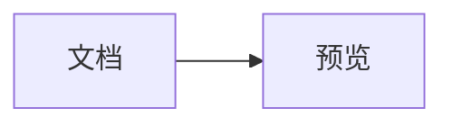
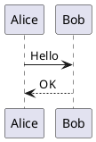

# Mermaid & PlantUML 选区预览

一个最小权限的 Chrome Manifest V3 扩展。启用后，在网页中选中 Mermaid 或 PlantUML 源码，右键选择“预览 Mermaid / PlantUML 图”，扩展会在当前页面上方打开轻量图表查看器，原文档保持可见。点击浮窗外区域、关闭按钮或按 `Esc` 即可退出。

浮层会自动将图表适配到舒适尺寸，并支持滚轮缩放、鼠标拖动、双击适应窗口，以及工具栏缩放。键盘可使用 `+`、`-`、`0`（适应窗口）、`1`（100%）和 `Esc`。

选区既可以包含 Markdown 围栏：

````markdown

````

也可以只选择 Mermaid 正文：


PlantUML 支持完整源码：



也支持 `plantuml`、`puml` 或 `uml` 围栏；围栏内缺少 `@startuml`/`@enduml` 时扩展会自动补齐。

## 构建和安装

```powershell
npm install
npm run check
```

然后打开 `chrome://extensions`，开启“开发者模式”，点击“加载已解压的扩展程序”，选择项目下的 `dist` 目录。

## 权限与隐私

- `contextMenus`：用于注册选区右键菜单。
- `activeTab` 与 `scripting`：仅在用户点击右键菜单后读取当前页面的真实选区并显示图表浮层；不提供持续的网页访问权限。
- `storage`：在右键事件与预览窗口间传递一次性选区；预览读取后立即删除，超过 5 分钟的异常残留会自动清理。
- 不申请网页读取权限，不注入 content script，不访问网络，也不会上传所选内容。
- Mermaid 以 `securityLevel: strict` 在扩展页面中渲染。
- PlantUML 使用官方 MIT 许可的 `@plantuml/core` TeaVM 引擎在浏览器内渲染，不访问公网服务；为避免隐式网络或文件读取，禁止 `!include` 和 `!import`。
