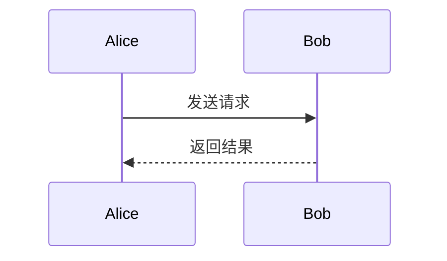

# 使用说明

本文说明 Mermaid & PlantUML 选区预览的安装、操作、输入格式、限制和本地开发方式。

## 安装

### 从 Chrome 网上应用店安装

打开 [Chrome 网上应用店页面](https://chromewebstore.google.com/detail/ahonaanmkbgmcbjlhfgpfleigbmedmlh)，点击“添加至 Chrome”。商店安装版本会自动接收后续更新。

### 从 GitHub Release 安装

1. 打开 [最新 Release](https://github.com/Tudou77826/mermaid-plantuml-selection-preview/releases/latest)。
2. 下载名称形如 `mermaid-plantuml-selection-preview-<版本号>.zip` 的文件。
3. 将 ZIP 解压到一个不会被移动或删除的目录。
4. 在 Chrome 地址栏输入 `chrome://extensions`。
5. 开启“开发者模式”。
6. 点击“加载已解压的扩展程序”，选择解压目录。

升级手动安装版本时，下载并解压新版文件，然后在扩展管理页点击该扩展的“重新加载”。

## 基本操作

1. 在网页中选中完整的 Mermaid 或 PlantUML 源码。
2. 打开右键菜单。
3. 点击“预览 Mermaid / PlantUML 图”。
4. 在页内浮层中查看图表。


浮层支持以下操作：

| 操作 | 方式 |
| --- | --- |
| 放大或缩小 | 滚轮、工具栏、`+`、`-` |
| 移动画布 | 按住鼠标拖动 |
| 自动适应窗口 | 双击画布、工具栏或 `0` |
| 恢复原始比例 | 工具栏或 `1` |
| 关闭预览 | 点击浮层外区域、关闭按钮或 `Esc` |

## 支持的输入

### Mermaid

可以选中完整的 Markdown 代码块：

````markdown

````

也可以只选中 Mermaid 正文：

```text
sequenceDiagram
  Alice->>Bob: 发送请求
  Bob-->>Alice: 返回结果
```

### PlantUML

可以选中完整源码：

```text
@startuml
Alice -> Bob: Hello
Bob --> Alice: OK
@enduml
```

也支持 `plantuml`、`puml` 或 `uml` Markdown 围栏。围栏内容缺少 `@startuml` 和 `@enduml` 时，扩展会自动补齐。

## 限制

- 单次选区最多支持 100,000 个字符。
- Chrome 内部页面、Chrome 网上应用店等受保护页面禁止扩展注入脚本。扩展会在可用时回退到独立预览窗口，但这些页面提供的选区文本可能丢失换行。
- PlantUML 的 `!include` 与 `!import` 被禁用，不支持从网络或本地文件加载外部内容。
- 手动安装版本不会自动更新。

## 故障排查

### 右键菜单没有出现

确认已经选中文字。若扩展刚安装或更新，请在 `chrome://extensions` 中点击“重新加载”，然后刷新原网页。

### 提示没有读取到源码

重新选中完整图表。选区可以包含语言围栏，也可以只包含正文，但不能只选中围栏标记。

### 图表解析失败

检查错误信息对应的行号，并确认选区没有混入正文段落、列表符号或另一个代码块。可先复制最小图表验证语法，再逐段恢复内容。

### PlantUML 图表无法渲染

确认源码是完整 PlantUML，且未使用 `!include` 或 `!import`。扩展不连接公共 PlantUML 服务器，所有渲染都在本机完成。

## 开发与构建

安装依赖：

```powershell
npm install
```

执行完整校验：

```powershell
npm run check
```

单独执行任务：

```powershell
npm run test
npm run build
npm run test:e2e
```

生成商店或 Release 使用的 ZIP：

```powershell
npm run package
```

主要目录：

| 路径 | 用途 |
| --- | --- |
| `src` | 扩展源码与页面样式 |
| `test` | Node.js 单元测试 |
| `scripts` | 构建、图标生成、打包和端到端测试 |
| `assets` | 图标源文件与生成后的扩展图标 |
| `dist` | 构建后的可加载扩展，不提交到 Git |
| `release` | 可发布 ZIP，不提交到 Git |

## 权限

| 权限 | 用途 |
| --- | --- |
| `contextMenus` | 提供选区右键预览入口 |
| `activeTab` | 用户触发后临时访问当前标签页 |
| `scripting` | 读取真实选区并显示预览浮层 |
| `storage` | 在本机短暂传递一次性选区 |

扩展不申请固定网站访问权限，不使用分析、广告或追踪服务。更多信息见 [隐私政策](../PRIVACY.md)。
