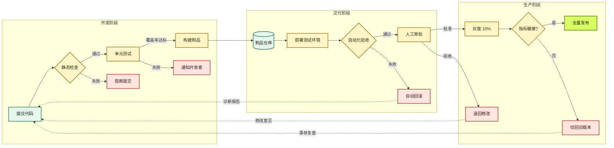
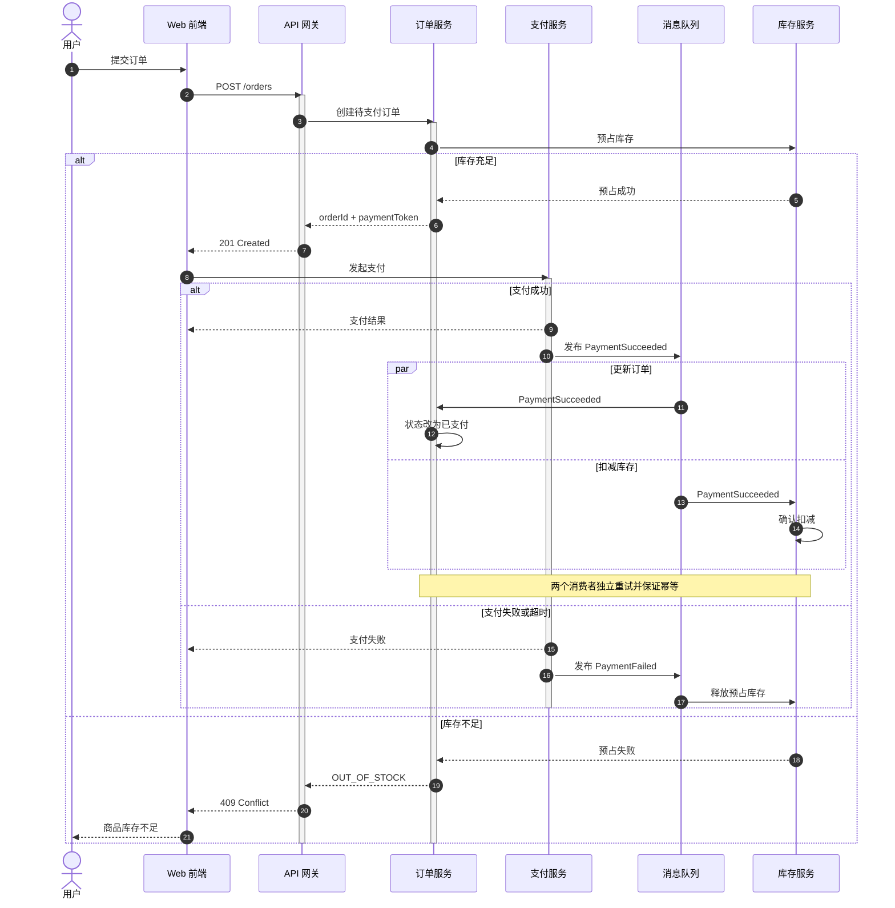
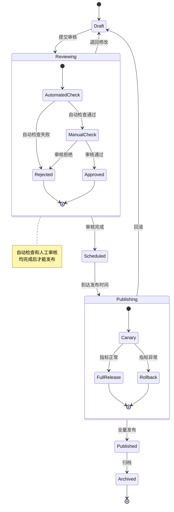
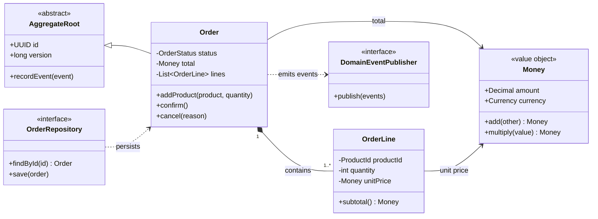
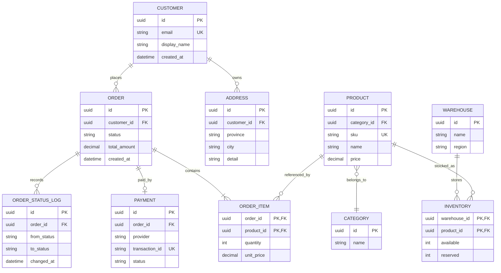
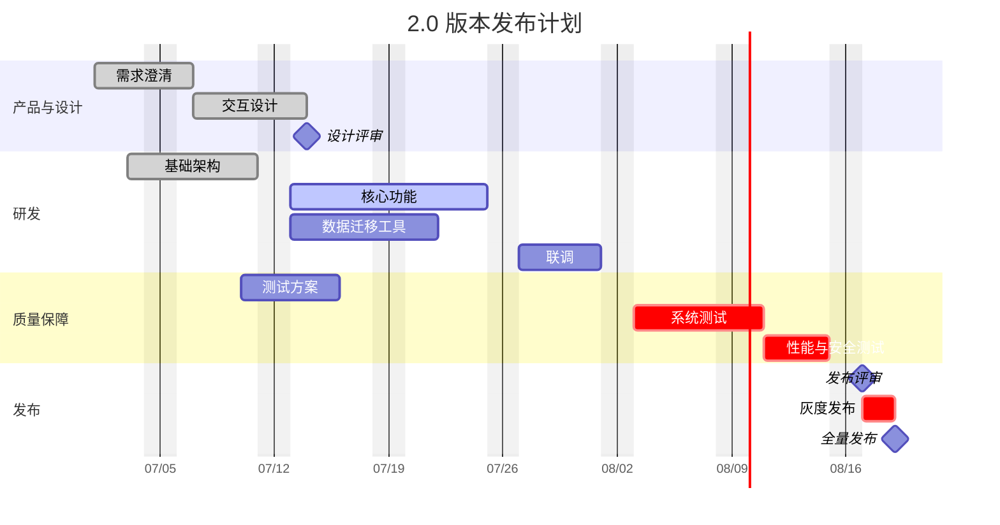
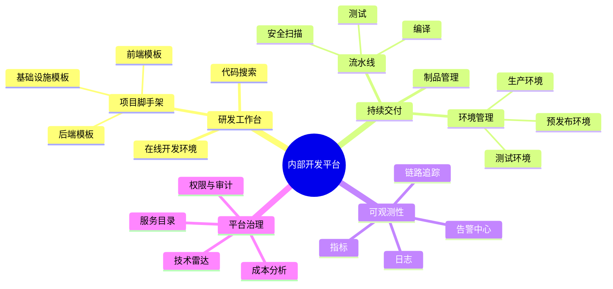
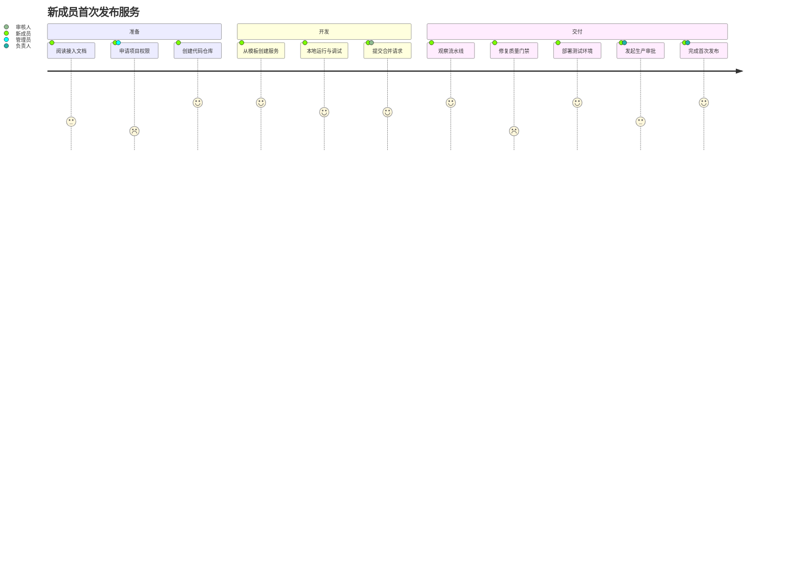

# Mermaid 右键预览测试集

本文档用于验证 Mermaid 选区预览扩展。每个示例都可以采用以下任一方式测试：

1. 框选整个代码块，包括开头的 ` ```mermaid ` 和结尾的 ` ``` `。
2. 只框选代码块内部的 Mermaid 正文，不包含 Markdown 围栏。

框选后点击鼠标右键，选择“预览 Mermaid 图”。

## 1. 多阶段发布流程图



## 2. 带并行和异常分支的时序图



## 3. 嵌套状态机



## 4. 领域模型类图



## 5. 电商数据模型 ER 图



## 6. 版本发布甘特图



## 7. 平台能力思维导图



## 8. 用户旅程图


